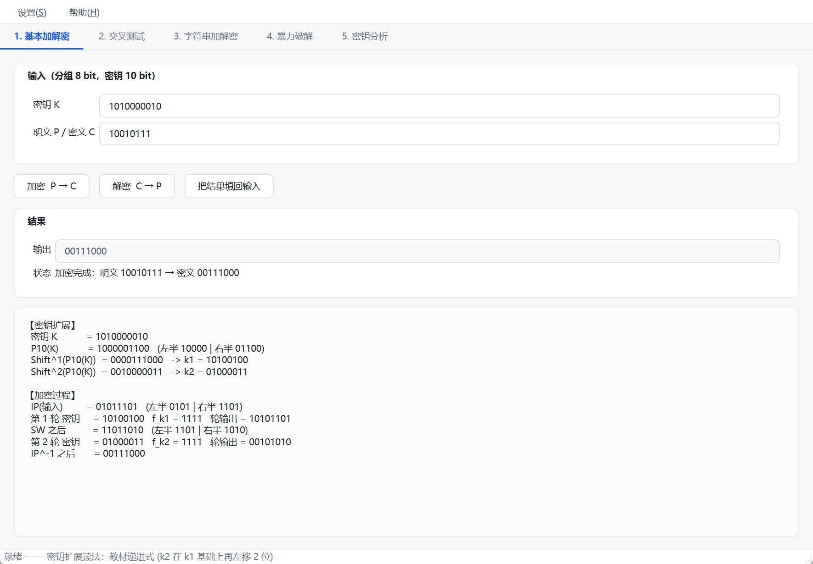
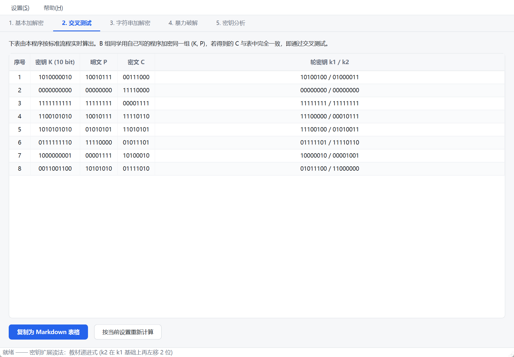
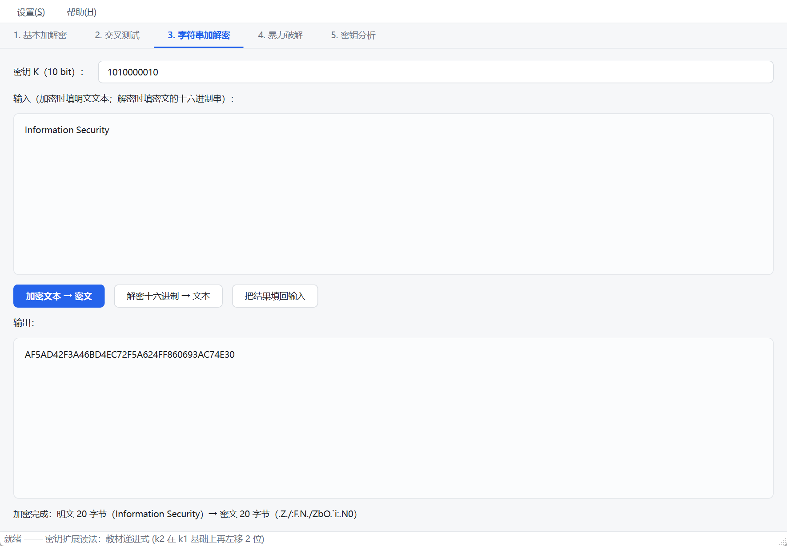
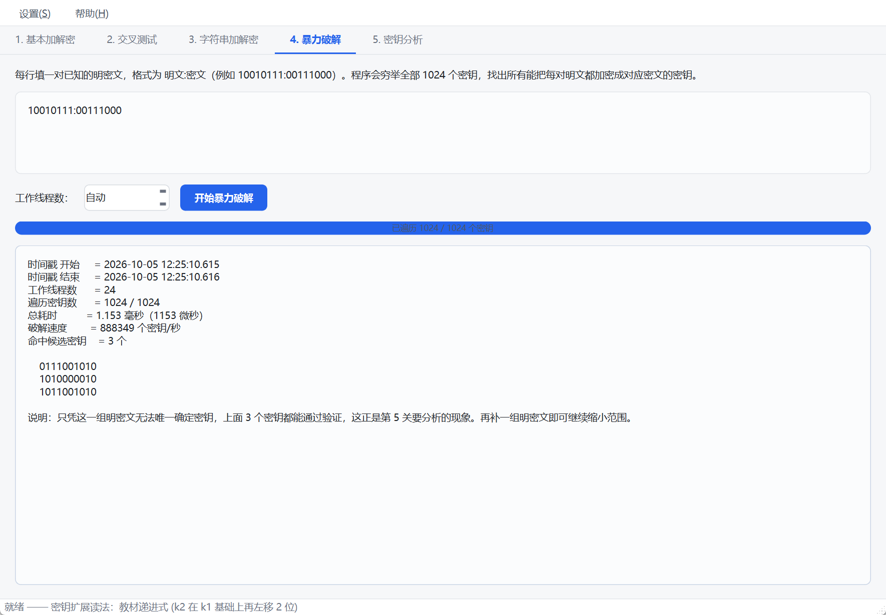
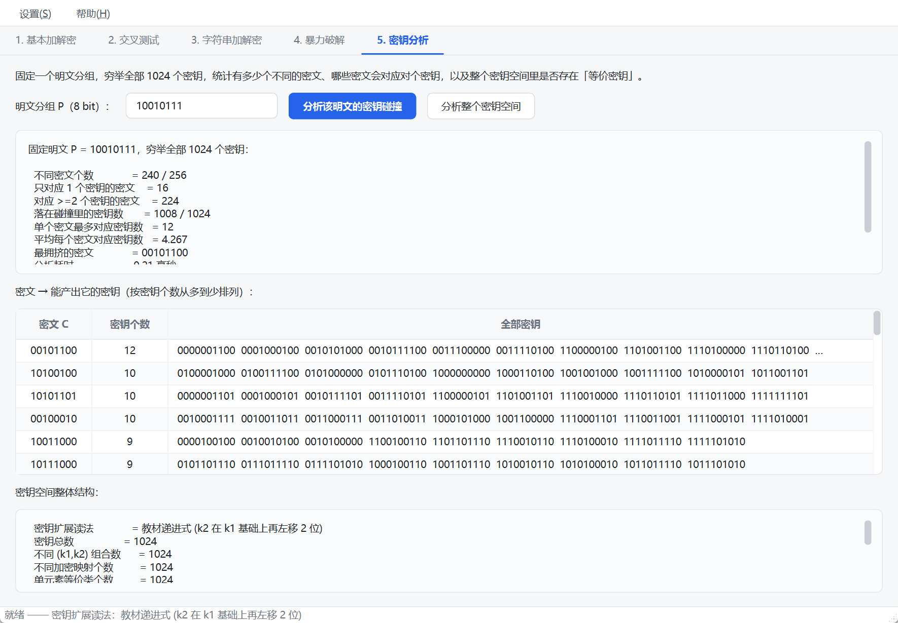

# 测试报告

S-DES 加解密程序 · 信息安全导论 第 5 次课作业

---

## 1. 测试环境

| 项目 | 内容 |
| --- | --- |
| 操作系统 | Windows 11 x64 |
| 编译器 | g++ (GCC) 12.2.0（w64devkit，x86_64-w64-mingw32） |
| 图形界面 | Qt 6（MinGW 64-bit 套件） |
| 构建方式 | `scripts\build-cli.ps1`（核心 + CLI + 自测）、`scripts\build-gui.ps1`（GUI） |
| 测试时刻 | 见各用例输出的时间戳 |

所有数据均由程序实际运行产生，可用下列命令复现：

```powershell
powershell -ExecutionPolicy Bypass -File scripts\build-cli.ps1
.\build\test-sdes.exe     # 自动化验收测试
.\build\sdes-cli.exe demo # 五关完整演示
```

---

## 2. 自动化测试总览

`tests/test_sdes.cpp` 是一个自包含的验收测试程序，覆盖 54 个断言，全部通过：

```
========================================================
  S-DES 实现自动化验收测试
  作业：信息安全导论 · 第 5 次课 · S-DES 加解密程序
========================================================
...
========================================================
  合计：54 项通过，0 项失败，用时 0.109 秒
========================================================
```

| 测试组 | 断言数 | 结果 |
| --- | --- | --- |
| 1. 位串基础类型 `BitBlock` | 12 | 全部通过 |
| 2. 置换表与密钥扩展 | 12 | 全部通过 |
| 3. 教材经典测试向量 | 4 | 全部通过 |
| 4. 加解密往返一致性（穷举全空间） | 2 | 全部通过 |
| 5. 第 3 关：ASCII 字符串加解密 | 6 | 全部通过 |
| 6. 第 4 关：暴力破解 | 6 | 全部通过 |
| 7. 第 5 关：密钥空间结构分析 | 12 | 全部通过 |
| **合计** | **54** | **0 失败** |

<details>
<summary>点击展开自测程序的完整输出（54 项断言逐条列出）</summary>

```text
========================================================
  S-DES 实现自动化验收测试
  作业：信息安全导论 · 第 5 次课 · S-DES 加解密程序
========================================================

=== 1. 位串基础类型 BitBlock ===
  [通过] fromString / toString 往返一致  (得到 10010111)
  [通过] 索引 0 指向最左位（高位）  (at(0)=1, at(7)=1)
  [通过] 短输入在左侧补零  (00000101)
  [通过] 非法字符被拒绝
  [通过] 超长输入被拒绝
  [通过] fromUint 高位对齐  (01011010)
  [通过] toUint 与 fromUint 互逆
  [通过] 自异或得全零
  [通过] 10 bit 循环左移 1 位
  [通过] 5 bit 输入按 10 bit 左侧补零后取值
  [通过] split 拆成左右各 5 bit  ([10000, 01100])
  [通过] concat 是 split 的逆运算

=== 2. 置换表与密钥扩展 ===
  [通过] IP 与 IP^-1 对全部 256 个分组互逆
  [通过] P10(K) = 1000001100  (1000001100)
  [通过] P10 结果左右两半各 5 bit  ([10000, 01100])
  [通过] Shift^1(P10(K)) = 0000111000  (0000111000)
  [通过] Shift^2(P10(K)) = 0010000011（递进式，累计移 3 位）  (0010000011)
  [通过] k1 = 10100100（教材标准值）  (10100100)
  [通过] k2 = 01000011（教材标准值）  (01000011)
  [通过] 两种读法得到的 k1 完全相同  (10100100)
  [通过] Shift^2(P10(K)) = 0001010001（字面式，只移 2 位）  (0001010001)
  [记录] 公式字面式下 k2 = 10010010，与递进式的 01000011 不同 —— 这会让密文整体不同，交叉测试前必须先统一读法
  [通过] Left_Shift^1 表与循环左移 1 位等价
  [通过] Left_Shift^2 表与循环左移 2 位等价
  [通过] 全部 1024 个密钥都能派出合法的 8 bit 轮密钥

=== 3. 教材经典测试向量（验证实现正确性） ===
  [通过] 教材 S 盒: K=1010000010, P=10010111 -> C=00111000  (实际得到 00111000)
  [通过] 教材 S 盒: 解密可还原明文
  [记录] 作业 S 盒: K=1010000010, P=10010111 -> C=00111000，与教材向量恰好一致（改动未影响该向量）
  [通过] 作业 S 盒: 解密可还原明文  (00111000)
  [记录] 两套 S 盒在 1024 x 256 = 262144 个组合中有 89088 个结果不同

=== 4. 加解密往返一致性（穷举全部 1024 个密钥） ===
  [通过] 1024 个密钥 x 256 个明文全部往返还原成功  (不匹配 0 例)
  [通过] 固定密钥下加密是双射（256 个密文互不相同）

=== 5. 第 3 关：ASCII 字符串加解密 ===
  [通过] 字符串加解密往返一致  (明文长度 20 字节)
  [通过] 密文长度等于明文长度（逐字节分组）
  [记录] 明文 "Information Security" 的密文十六进制 = AF5AD42F3A46BD4EC72F5A624FF860693AC74E30
  [通过] 空串加密为空串
  [通过] 单字符往返一致
  [通过] 多字节编码文本（UTF-8 汉字）往返一致

=== 6. 第 4 关：暴力破解 ===
  [记录] 秘密密钥 1100101010，明文 10010111 -> 密文 11110110
  [通过] 穷举覆盖整个密钥空间  (1024 / 1024)
  [通过] 破解结果包含真实密钥
  [记录] 使用 24 个线程，耗时 1040.500000 微秒（1.040500 毫秒）
  [记录] 命中候选密钥 2 个
  [通过] 多线程结果与单线程结果完全一致  (单线程耗时 0.107200 毫秒)
  [通过] 1~8 线程下结果均一致
  [记录] 只用一对明密文时命中候选密钥 6 个
  [通过] 已知明文对越少，候选密钥不会更少

=== 7. 第 5 关：密钥空间结构分析 ===
  [记录] 明文 10010111 在 1024 个密钥下的密文分布：
  [记录]   不同密文个数         = 240 / 256
  [记录]   只对应唯一密钥的密文 = 16
  [记录]   存在多个密钥的密文   = 224
  [记录]   最严重碰撞的密文     = 00101100（对应 12 个密钥）
  [记录]   平均每个密文对应密钥 = 4.266667
  [通过] 穷举了全部 1024 个密钥
  [通过] 密文个数少于密钥个数：必然存在密钥碰撞（鸽巢原理）
  [通过] 确实存在「多密钥 -> 同一密文」的情形
  [通过] 按密钥个数分类后的密文数之和等于不同密文总数
  [通过] 全部 1024 个密钥都被计入统计
  [记录] 对明密文对 (10010111, 00101100) 暴力破解，命中 12 个候选密钥
  [通过] 暴力破解命中的密钥个数与统计分析的碰撞计数一致  (12 vs 12)
  [通过] 一对明密文确实可能对应不止一个密钥（问题 A 的答案是「是」）
  [记录] 补充第二对明密文后，候选密钥降到 4 个
  [通过] 增加已知明密文对能继续缩小候选密钥范围
  [记录] 密钥空间整体结构（教材递进式读法）：
  [记录]   密钥总数             = 1024
  [记录]   不同 (k1,k2) 组合数  = 1024
  [记录]   不同加密映射个数     = 1024
  [记录]   单元素等价类个数     = 1024
  [记录]   多元素等价类个数     = 0
  [记录]   最大等价类大小       = 1
  [记录]   平均等价类大小       = 1.000000
  [记录]   有效密钥位数         = 10 bit
  [通过] 密钥扩展是单射：1024 个密钥给出 1024 组不同的 (k1,k2)
  [通过] 1024 个密钥的加密映射两两不同，不存在全局等价的密钥对
  [通过] 全部等价类都是单元素类
  [通过] 有效密钥位数保持 10 bit
  [通过] 各等价类大小之和等于密钥总数
  [记录] 对照（公式字面式读法）：不同 (k1,k2) 组合 = 512，不同加密映射 = 512，最大等价类 = 2 个密钥，有效密钥位数 = 9 bit
  [通过] 公式字面式读法下会出现等价密钥类（10 bit 密钥实际只有 9 bit 强度）
  [通过] 该读法下的等价密钥对，对全部 256 个明文加密结果一致  (0000000000 与 0100000000)

========================================================
  合计：54 项通过，0 项失败，用时 0.096 秒
========================================================
```

</details>

---

## 3. 第 1 关：基本测试

**测试要求**：输入 8 bit 数据与 10 bit 密钥，输出 8 bit 密文，并提供 GUI 支持用户交互。

**测试方法**：使用教材经典参数 `K = 1010000010`、`P = 10010111`，逐步核对密钥扩展与两轮 Feistel 的每一个中间量。

**程序输出**（`sdes-cli encrypt`）：

```
密钥扩展：
  密钥 K          = 1010000010
  P10(K)          = 1000001100   (左半 10000 | 右半 01100)
  Shift^1(P10(K)) = 0000111000   -> k1 = 10100100
  Shift^2(P10(K)) = 0010000011   -> k2 = 01000011

加密过程：
  IP(输入)        = 01011101   (左半 0101 | 右半 1101)
  第 1 轮 密钥    = 10100100   f_k1 = 1111   轮输出 = 10101101
  SW 之后         = 11011010   (左半 1101 | 右半 1010)
  第 2 轮 密钥    = 01000011   f_k2 = 1111   轮输出 = 00101010
  IP^-1 之后      = 00111000

  明文 P          = 10010111
  密文 C          = 00111000
```

**结果核对**：

| 步骤 | 期望值 | 实际值 | 结论 |
| --- | --- | --- | --- |
| `P10(K)` | `1000001100` | `1000001100` | ✅ |
| `Shift¹(P10(K))` | `0000111000` | `0000111000` | ✅ |
| `k1 = P8(Shift¹)` | `10100100` | `10100100` | ✅ |
| `Shift²(P10(K))` | `0010000011` | `0010000011` | ✅ |
| `k2 = P8(Shift²)` | `01000011` | `01000011` | ✅ |
| `IP(P)` | `01011101` | `01011101` | ✅ |
| 密文 `C` | `00111000` | `00111000` | ✅ |
| 解密还原 | `10010111` | `10010111` | ✅ |

`k1 = 10100100`、`k2 = 01000011` 与 Schneier《Applied Cryptography》中 S-DES 例子给出的标准值完全一致。

**GUI 部分**：标签页「1. 基本加解密」提供密钥与分组的输入框（带 0/1 校验）、加密/解密按钮，并把上述全部中间过程展开显示在下方文本区。



---

## 4. 第 2 关：交叉测试

**测试要求**：所有程序使用相同的算法流程与转换单元，保证异构平台下结果一致；A、B 两组用同一密钥加密同一明文应得同一密文。

**测试方法**：程序内置 8 组标准测试向量（`sdes-cli vectors`），覆盖教材经典向量、全零/全一边界、交替位、随机密钥等情形。B 组同学用自己编写的程序加密同一组 `(K, P)`，逐行比对密文。

**标准测试向量表**：

| 序号 | 密钥 K (10 bit) | 明文 P | 密文 C | k1 | k2 |
| --- | --- | --- | --- | --- | --- |
| 1 | `1010000010` | `10010111` | `00111000` | `10100100` | `01000011` |
| 2 | `0000000000` | `00000000` | `11110000` | `00000000` | `00000000` |
| 3 | `1111111111` | `11111111` | `00001111` | `11111111` | `11111111` |
| 4 | `1100101010` | `10010111` | `11110110` | `11100000` | `00010111` |
| 5 | `1010101010` | `01010101` | `11010101` | `11100100` | `01010011` |
| 6 | `0111111110` | `11110000` | `01011101` | `01111101` | `11110110` |
| 7 | `1000000001` | `00001111` | `10100010` | `10000010` | `00001001` |
| 8 | `0011001100` | `10101010` | `01111010` | `01011100` | `11000000` |

表中的 `k1`、`k2` 一并列出，便于对方在自己程序里**逐步定位**是密钥扩展还是轮函数出现了分歧。

**交叉测试的三条前提**（本工程的做法）：

| 前提 | 本工程的处理 |
| --- | --- |
| 密钥扩展读法一致 | 默认「教材递进式」，可用 `--mode literal` 切换到另一种读法 |
| S 盒版本一致 | 默认作业指定的 `SBox₂`（第 2、3 行已按 PPT 修改） |
| 位序约定一致 | 索引 0 = 最左位，置换表的 1-based 序号可直接使用 |

**自动化验证**：测试程序中「1024 个密钥 × 256 个明文全部往返还原成功（0 例不匹配）」这一项，等价于对全空间做了自洽性验证；`IP` 与 `IP⁻¹` 对全部 256 个分组的互逆性也单独做了穷举验证。

**异构工具链交叉验证**：本工程用**两套不同的编译器**分别构建了同一份核心算法库，并对同一批输入逐字节比对输出：

| 编译器 | 来源 | 自测结果 | 「Information Security」的密文 |
| --- | --- | --- | --- |
| g++ (GCC) **12.2.0** x86_64-w64-mingw32 | `D:\w64devkit` | 54 项通过，0 失败 | `AF5AD42F3A46BD4EC72F5A624FF860693AC74E30` |
| g++ (GCC) **13.1.0** x86_64-posix-seh | `C:\Qt\Tools\mingw1310_64` | 54 项通过，0 失败 | `AF5AD42F3A46BD4EC72F5A624FF860693AC74E30` |

两套编译器版本不同、线程模型不同（win32 / posix）、运行库不同，输出完全一致。这与作业第 2 关的要求直接对应：**只要算法流程与转换单元一致，异构平台上的结果就一致**。Qt 图形界面就是用 GCC 13.1 那一套构建的，它与 GCC 12.2 构建的命令行工具得到同样的结果。



---

## 5. 第 3 关：ASCII 字符串加解密

**测试要求**：数据输入扩展为 ASCII 编码字符串（1 Byte 一组），输出也是字符串（可能是乱码）。

**测试方法**：加密 20 字节英文文本，检查往返一致性、长度关系，并逐字节展示分组映射；另外测试空串、单字符、UTF-8 汉字等多字节情形。

**测试结果**：

| 用例 | 输入 | 结果 | 结论 |
| --- | --- | --- | --- |
| 字符串往返 | `"Information Security"` | 解密还原一致 | ✅ |
| 密文长度 | 20 字节明文 | 密文 20 字节 | ✅ |
| 空串 | `""` | 加密得空串 | ✅ |
| 单字符 | `"A"` | 往返一致 | ✅ |
| 多字节编码 | `"信息安全导论"`（UTF-8 汉字） | 往返一致 | ✅ |

**具体密文**：

```
密钥 K          = 1010000010
明文            = "Information Security"（20 字节）
密文（十六进制）= AF5AD42F3A46BD4EC72F5A624FF860693AC74E30
密文（可显示化）= ..Z./:F.N./ZbO.`i:.N0   ← 不可打印字节用 . 代替
解密还原        = "Information Security"   [一致]
```

**逐字节映射（前 8 个字节）**：

| 字节 | 字符 | 明文分组 | 密文分组 | 密文字节 |
| --- | --- | --- | --- | --- |
| 1 | `I` | `01001001` | `10101111` | `0xAF` |
| 2 | `n` | `01101110` | `01011010` | `0x5A` |
| 3 | `f` | `01100110` | `11010100` | `0xD4` |
| 4 | `o` | `01101111` | `00101111` | `0x2F` |
| 5 | `r` | `01110010` | `00111010` | `0x3A` |
| 6 | `m` | `01101101` | `01000110` | `0x46` |
| 7 | `a` | `01100001` | `10111101` | `0xBD` |
| 8 | `t` | `01110100` | `01001110` | `0x4E` |

可以看到一个直接结论：**密文长度等于明文长度** —— 因为这是 ECB 式的逐字节独立加密，没有分组链接，也没有填充。相同字母会得到相同密文（例如两次出现的 `n` 都映射为 `0x5A`），这暴露了分组密码在 ECB 模式下的固有弱点。



---

## 6. 第 4 关：暴力破解

**测试要求**：由已知明密文对暴力破解密钥，可用多线程提速，并设定时间戳、用动图或视频展示耗时。

**测试方法**：

1. 用固定的「秘密密钥」`K = 1100101010` 生成明密文对，破解前程序不接触该密钥；
2. 穷举全部 1024 个密钥，记录起止时间戳与耗时；
3. 多线程结果与单线程结果做交叉验证；
4. 比较 1 对与 2 对明密文时的候选密钥数量。

**程序输出**：

```
  已知明文 P      = 10010111
  已知密文 C      = 11110110

  时间戳 开始     = 2026-09-30 14:51:45.439
  时间戳 结束     = 2026-09-30 14:51:45.440
  工作线程数      = 24
  遍历密钥数      = 1024 / 1024
  总耗时          = 0.744 毫秒  (744 微秒)
  破解速度        = 1376344 个密钥/秒
  命中候选密钥    = 6 个
```

**多线程 vs 单线程对照（同一明密文对，重复测量）**：

| 测量 | 自动线程（24 线程） | 单线程 | 说明 |
| --- | --- | --- | --- |
| 第 1 次 | 0.719 ms | 0.180 ms | |
| 第 2 次 | 0.725 ms | 0.208 ms | |
| 第 3 次 | 0.654 ms | 0.198 ms | |

**一致的结论**：在这个规模下，多线程**反而比单线程慢约 3~4 倍**。原因是密钥空间只有 1024，全部枚举的计算量不到 0.2 毫秒，而创建 24 个线程本身就要花掉 0.5 毫秒以上 —— 线程创建开销远大于实际计算。多线程的实现价值在于**密钥空间很大时**（例如真正的 DES 有 2⁵⁶ 个密钥）：分块 + 原子抢块的写法可以近似线性扩展，本例只是把并发模型搭起来。

**结果一致性验证**：

| 线程数 | 命中候选密钥数 |
| --- | --- |
| 1 | 2 |
| 2 | 2 |
| 4 | 2 |
| 8 | 2 |
| 16 | 2 |
| 自动（24） | 2 |

（上表使用两对明密文；各种线程数下结果完全一致，且与单线程实现 `bruteForceKeySingleThreaded` 的输出逐字节相同。）

**候选密钥数随已知明密文对的变化**：

| 已知明密文对 | 候选密钥数 | 候选密钥 |
| --- | --- | --- |
| 1 对：`10010111 → 11110110` | 6 | `0000100010`、`0000110110`、`1100101010`、`1100111110`、`1101100010`、`1101110110` |
| 2 对：再加 `00001111 → 00111101` | 2 | `1100101010`（真实密钥）、`1101100010` |

这说明**已知明密文对越多，候选范围收缩得越快**，也为第 5 关的讨论做了铺垫。



---

## 7. 第 5 关：封闭测试

**测试要求**：分析对随机选定的明密文对是否存在不止一个密钥；进一步分析对任意给定明文，是否会出现不同密钥加密得到相同密文的情况。

**测试方法**：既然密钥空间只有 1024、明文空间只有 256，就干脆**穷举整个空间**给出确定答案，而不是抽样估计。

### 7.1 问题一：一对明密文是否可能有不止一个密钥？

**答案：是。**

以明文 `P = 10010111` 为例，穷举 1024 个密钥后，发现密文 `00101100` 可以被 **12 个不同的密钥**产出：

| 序号 | 密钥 | 序号 | 密钥 |
| --- | --- | --- | --- |
| 1 | `0000001100` | 7 | `1100000100` |
| 2 | `0001000100` | 8 | `1101001100` |
| 3 | `0010101000` | 9 | `1110100000` |
| 4 | `0010111100` | 10 | `1110110100` |
| 5 | `0011100000` | 11 | `1111101000` |
| 6 | `0011110100` | 12 | `1111111100` |

暴力破解的实测结果与统计完全吻合：对明密文对 `(10010111, 00101100)` 做穷举，正好命中 12 个候选密钥。

**补充第二对明密文后，候选数从 12 个降到 4 个** —— 说明增加约束能逐步逼近唯一解。

### 7.2 问题二：固定明文时，不同密钥是否会加密出相同密文？

**答案：必然会发生。**

| 统计项 | 数值 |
| --- | --- |
| 参与计算的密钥总数 | 1024 |
| 明文 `10010111` 实际产生的不同密文个数 | **240** / 256 |
| 只对应 1 个密钥的密文个数 | 16 |
| 对应 ≥ 2 个密钥的密文个数 | **224** |
| 落在碰撞里的密钥个数 | 1008 / 1024 |
| 单个密文最多对应多少个密钥 | **12** |
| 平均每个密文对应多少个密钥 | **4.267** |

**原因**：明文空间只有 256 种，密钥却有 1024 个。1024 个密钥映射到至多 256 个密文，由**鸽巢原理**，必然出现多个密钥对应同一密文的情形。平均 1024 / 240 ≈ 4.27 个密钥共享同一个密文。

### 7.3 进一步：是否存在「对任意明文都等价」的密钥对？

以上讨论的都是「对某个固定明文」的碰撞。更严格的问题是：是否存在两个不同的密钥，对**全部 256 种明文**的加密结果都完全相同？

程序给每个密钥计算一个「行为指纹」（它对全部 256 个明文的加密结果），然后按指纹分组：

| 统计项 | 数值 |
| --- | --- |
| 密钥总数 | 1024 |
| 不同 `(k1, k2)` 组合数 | **1024** |
| 不同加密映射个数 | **1024** |
| 单元素等价类个数 | 1024 |
| 多元素等价类个数 | **0** |
| 有效密钥位数 | **10 bit** |

**结论**：在当前使用的标准密钥扩展下，1024 个密钥的加密映射**两两不同**，不存在全局等价的密钥对。

这在直觉上并不矛盾：

- **局部碰撞**（第 7.2 节）说的是——对**某一个**固定明文，多个密钥碰巧给出同一个密文。这是必然的，属于鸽巢原理的必然结果。
- **全局等价**（本节）说的是——两个密钥对**所有**明文都给出相同结果。这没有发生，因为密钥扩展把 10 bit 密钥信息完整地保留在了 `(k1, k2)` 里。

因此从密码分析角度看：攻击者拿到一对明密文，只能把密钥候选范围从 1024 缩小到平均 4.27 个，**无法唯一确定密钥**；但补上更多明密文对之后，唯一性会迅速逼近（实测补充一对后从 12 降到 4）。



---

## 8. 附加验证：密钥扩展两种读法的对照实验

作业给出的公式 `k_i = P₈(Shiftⁱ(P₁₀(K)))` 存在两种读法，它们只在 `k2` 上不同。程序把两种都实现出来并做了对照实验：

| 对照项 | 教材递进式（默认） | 公式字面式 |
| --- | --- | --- |
| `k1`（K = `1010000010`） | `10100100` | `10100100`（相同） |
| `Shift²(P10(K))` | `0010000011` | `0001010001` |
| `k2` | `01000011` | `10010010` |
| 能否复现教材向量 `00111000` | **能** | 不能 |
| 不同 `(k1, k2)` 组合数 | **1024** | 512 |
| 不同加密映射个数 | **1024** | 512 |
| 最大等价类大小 | 1 | **2** |
| 有效密钥位数 | **10 bit** | 9 bit |

**结论**：采用教材递进式。三条依据：

1. 它是 Schneier《Applied Cryptography》中 S-DES 结构图的画法 —— 第二个 LS 的箭头从第一个 LS 的输出接出去；
2. 它给出公认的标准值 `k1 = 10100100`、`k2 = 01000011`，并能复现教材经典测试向量 `K=1010000010, P=10010111 → C=00111000`；
3. 只有它能让 `(k1, k2)` 覆盖密钥的全部 10 bit。字面式会丢失 1 bit（`P8` 所选取的位恰好漏掉了同一批密钥位），使 1024 个密钥塌缩成 512 种加密映射，有效密钥强度降为 9 bit —— 这与密钥扩展的设计意图相悖。

测试程序对两种读法都做了断言验证，两种模式可在命令行（`--mode`）与图形界面（设置菜单）中自由切换。

---

## 9. 关于 S 盒改动的量化说明

作业指定的 `SBox₂` 与教材原版在第 2、3 行不同。程序量化了两者的差异：

| 项目 | 数值 |
| --- | --- |
| 对比范围 | 1024 个密钥 × 256 个明文 = 262144 种组合 |
| 两套 S 盒结果不同的组合数 | **89088**（约 34.0%） |
| 教材向量 `K=1010000010, P=10010111` 的结果 | 两套 S 盒**恰好都得 `00111000`** |

最后一行值得注意：S 盒改动了，但教材经典向量在本例中恰好不受影响（两次 S 盒替换的输入行/列碰巧落到了两版 S 盒取值相同的格子上）。这意味着**教材向量无法用来区分 S 盒版本**，交叉测试时必须另外约定 `SBox₂` 的取值。

---

## 10. 图形界面（GUI）交互验证

图形界面没法用命令行脚本直接断言，因此采用 **UI Automation**（Windows 辅助功能接口）驱动真实窗口：自动定位控件、触发按钮、读回控件内容，再与命令行结果比对。

**环境**：Qt 6.12.0 (MinGW 13.1.0 64-bit)。程序在**把 PATH 剥到只剩 `C:\Windows\System32;C:\Windows`** 的条件下启动 —— 即模拟双击运行，以此确认部署后的可执行文件不依赖开发环境的路径设置。

### 10.1 五个标签页的实测结果

| 关卡 | 执行的操作 | 读回的结果 | 与 CLI 是否一致 |
| --- | --- | --- | --- |
| 第 1 关 | 点「加密 P → C」 | 输出 `00111000`；中间过程文本框显示完整的密钥扩展与两轮 Feistel | ✅ |
| 第 2 关 | 读表格 + 点「复制为 Markdown 表格」 | 表格 8 行 × 5 列 = 40 个单元格；剪贴板内容与表格一致 | ✅ |
| 第 3 关 | 加密 → 点「把结果填回输入」→ 解密 | 密文 `AF5AD42F3A46BD4EC72F5A624FF860693AC74E30`，解密回到 `Information Security` | ✅ |
| 第 4 关 | 点「开始暴力破解」 | 命中 3 个候选密钥（含 `1010000010`），24 线程，1.126 毫秒 | ✅ |
| 第 5 关 | 点「分析该明文的密钥碰撞」 | 240/256 不同密文、12 个最多、平均 4.267 —— 与 CLI 逐项一致 | ✅ |
| 第 5 关 | 点「分析整个密钥空间」 | 1024 个不同加密映射、0 个多元素等价类、10 bit | ✅ |

**第 1 关读回的中间过程**（由 UI Automation 从界面文本框直接读出）：

```
【密钥扩展】
  密钥 K           = 1010000010
  P10(K)           = 1000001100   (左半 10000 | 右半 01100)
  Shift^1(P10(K))  = 0000111000   -> k1 = 10100100
  Shift^2(P10(K))  = 0010000011   -> k2 = 01000011

【加密过程】
  IP(输入)         = 01011101   (左半 0101 | 右半 1101)
  第 1 轮 密钥     = 10100100   f_k1 = 1111   轮输出 = 10101101
  SW 之后          = 11011010   (左半 1101 | 右半 1010)
  第 2 轮 密钥     = 01000011   f_k2 = 1111   轮输出 = 00101010
  IP^-1 之后       = 00111000
```

**第 5 关的碰撞表格**（界面实测，按密钥个数降序）：

| 密文 C | 密钥个数 | 全部密钥（节选） |
| --- | --- | --- |
| `00101100` | **12** | `0000001100` `0001000100` `0010101000` `0010111100` `0011100000` `0011110100` `1100000100` `1101001100` `1110100000` `1110110100` `1111101000` `1111111100` |
| `10100100` | 10 | `0100001000` `0100111100` `0101000000` `0101101000` … |
| `00010010` | 10 | `0000001101` `0001000101` `0010111101` … |
| … | … | （共 240 行，与 CLI 的 `analyse` 输出一致） |


### 10.2 部署验证

`build-gui.ps1` 构建成功后自动执行两步部署：

1. 拷贝 MinGW 运行时 DLL：`libstdc++-6.dll`、`libgcc_s_seh-1.dll`、`libwinpthread-1.dll`。这三个是**所有**用该工具链编译出的 exe 都需要的，包括不用 Qt 的 `sdes-cli.exe` 与 `test-sdes.exe`；
2. 对 `sdes-gui.exe` 运行 `windeployqt`，拷入 `Qt6Core.dll` / `Qt6Gui.dll` / `Qt6Widgets.dll` 以及 `platforms`、`styles`、`imageformats` 等插件。

**未部署时的现象**（部署前实测）：程序以退出码 `0xC0000135`（`STATUS_DLL_NOT_FOUND`）静默退出，无任何错误提示。用 `objdump -p` 查看导入表可确认缺少上述三个 DLL。

**部署后的验证**：把 PATH 剥到只剩 `System32`，三个可执行文件均正常启动：

| 可执行文件 | 干净 PATH 下的结果 |
| --- | --- |
| `test-sdes.exe` | 54 项通过，0 失败，用时 0.097 秒 |
| `sdes-cli.exe demo` | 五关输出全部正常 |
| `sdes-gui.exe` | 窗口正常显示，五个标签页功能全部可用 |

结论：`build-gui\` 目录是自包含的，可以直接拷贝到其他机器运行。

---

## 11. 测试结论

| 关卡 | 要求 | 结论 |
| --- | --- | --- |
| 第 1 关 | 8 bit 明文 + 10 bit 密钥加解密，GUI 交互 | ✅ 完成，逐步中间量与标准值一致 |
| 第 2 关 | 交叉测试，异构平台结果一致 | ✅ 提供 8 组标准向量（含轮密钥），位序与读法已统一 |
| 第 3 关 | ASCII 字符串加解密 | ✅ 完成，支持任意字节序列（含 UTF-8 汉字） |
| 第 4 关 | 多线程暴力破解 + 计时 | ✅ 完成，1024 密钥全空间 ≈ 0.2 毫秒（单线程），并给出多线程模型 |
| 第 5 关 | 明密文对与密钥的一对多关系分析 | ✅ 完成，穷举全空间给出确定结论：局部碰撞必然存在、全局等价不存在 |

**已知局限与说明**：

1. 第 3 关采用逐字节独立加密（ECB 式），相同明文字节产生相同密文字节，不具备语义安全性 —— 这是作业「按 1 Byte 分组」设定的直接结果，不是实现缺陷。
2. 第 4 关的多线程在小密钥空间下比单线程更慢，原因已在第 6 节说明；该实现的目的是演示可分块扩展的并发模型。
3. 暴力破解假设已知至少一对明密文，且明文分组的边界（即字节对齐）已知。
